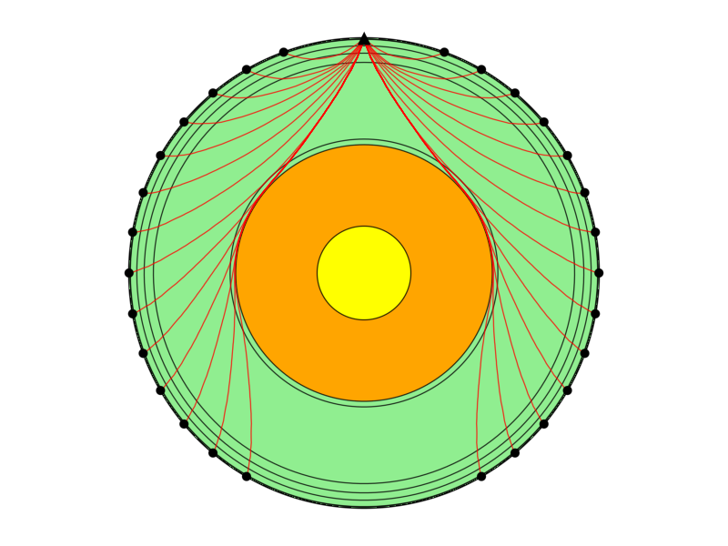

# RayTracer.jl
## Current dependencies 

1. SparseArrays
2. Interpolations
3. CUDA (experimental)
4. DelimitedFiles
5. to generate output: CSV, DataFrames, MAT (MATLAB output format shall be dropped for releaseversion)

## TODO list
- [ ] API
- [x] Optimize sparse graph (mvoed from SparseArray to cystom data structured)
- [ ] Optimize addition of secondary nodes (for now it crashes for azimuthal spacing less than 15km)
- [ ] Wrapper for 3D mesh

## Example 2D annulus
```julia
include("src/ShortestPath.jl")

# number of elements in the azimuthal and radial direction
nθ, nr = 180, 60
# Instantiate grid
gr, G = init_annulus(nθ, nr, spacing = 20, star_levels = 2)
# Transform graph into appropriate data type
Ga = sparse_adjacency_list(G);

# find source node
source_θ, source_r = 0.0, R # e.g. node at north pole
source = closest_point(gr, source_θ, source_r; system = :polar)

# Load Vp-Vs Earths Profile
profile = velocity_profile() # AK135
# make velocity interpolant
interpolant = LinearInterpolation(profile.r, profile.Vp)

# Vp and Vs profiles interpolated onto the grid
Vp = interpolate_velocity(round.(gr.r, digits=2), interpolant, buffer = 0)
Vp = dual_velocity(round.(gr.r, digits=2), interpolant, buffer = 1)

# Find Shortest path
D = bfm(Ga, source, gr, Vp);

# find multiple receiver paths paths
receivers_θ = 10f0:10f0:150f0
receivers_θ = vcat(receivers_θ, reverse(360 .-receivers_θ) )
receivers_r = R
receivers = [closest_point(gr, deg2rad(deg), receivers_r; system = :polar) for deg in receivers_θ]
paths = [recontruct_path(D.prev, source, r) for r in receivers]

# Plot
# define earths boundary
Nsurf = 360 # number of points
xs, zs = circle(Nsurf, R, pop_end = false)
layers = layers2plot()
plot_paths(gr, paths, xs, zs, layers, source, receivers)
```


